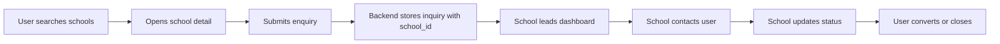

# End User Persona: Search & Enquiry Flow

**Status:** Draft for review  
**Scope:** Public learner journey from school discovery to enquiry follow-up  
**Connected Modules:** Geo-search, school detail, enquiry submission, school leads dashboard

---

## 1. Purpose

This document defines the end user persona for people searching for driving schools and explains how they send an enquiry. It also connects the public enquiry flow to the school-side handling flow so the full lead lifecycle is visible in one place.

This is the review document for the public discovery-to-lead path before implementation is finalized.

---

## 2. End User Persona

### Persona A — Prospective Learner / Parent / Working Professional

**Profile**
- Looking for a nearby driving school
- Wants fast comparison, trust signals, and clear pricing
- May be a first-time learner, parent enrolling someone else, or a working adult learning to drive
- Often uses mobile first, with short browsing sessions

**Primary Goals**
- Find a school near their locality
- Compare schools by proximity, rating, price, vehicle type, and features
- Contact the right school quickly
- Track whether the school responds

**Pain Points**
- Too many schools with unclear differences
- Unclear pricing or package details
- Slow response from schools
- Difficulty knowing which schools are verified
- Forms that ask for too much information too early

**Success Criteria**
- Can search without signing up
- Can open a school detail page quickly
- Can send an enquiry in under a minute
- Receives confirmation that the enquiry reached the school
- Sees clear trust signals before making contact

---

## 3. Journey Overview

The public journey starts before sign-up. The user can browse, compare, and enquire without an account.

### Step 1 — Discover Schools
- User lands on the home page or search page
- User searches by locality or uses nearby search
- User filters by vehicle type, pickup/drop, rating, and other preferences

### Step 2 — Compare Options
- User scans school cards
- User opens a school detail page for deeper review
- User checks pricing, reviews, location, timings, and trust markers

### Step 3 — Send Enquiry
- User opens the enquiry form from the school detail page
- User enters contact information and training intent
- User submits the enquiry

### Step 4 — School Receives Lead
- Enquiry is stored with the target school ID
- The school sees the lead in its dashboard
- School updates the lead status as it follows up

### Step 5 — School Responds
- School contacts the user by phone, email, or WhatsApp
- School changes lead status to contacted, enrolled, or closed

### Step 6 — User Outcome
- User receives a callback or direct response
- User continues with the chosen school or returns to search

---

## 4. Search-to-Enquiry Scenarios

### Scenario 1 — Anonymous User Searches and Enquires

1. Opens the homepage or search page
2. Searches by locality or near-me location
3. Applies filters
4. Opens a school detail page
5. Clicks `Send Inquiry`
6. Completes the enquiry form
7. Sees confirmation

**Acceptance Criteria**
- Search works without login
- Enquiry can be submitted without creating an account
- School receives the lead with the correct school ID

---

### Scenario 2 — User Compares Multiple Schools Before Enquiry

1. Searches schools
2. Opens multiple school detail pages
3. Compares ratings, prices, and facilities
4. Sends enquiry to one or more schools

**Acceptance Criteria**
- User can return to search without losing context
- Enquiry form is school-specific
- Each submission maps to the correct school

---

### Scenario 3 — User Uses Mobile and Wants a Fast Action

1. Finds a school on mobile
2. Opens the sticky enquiry CTA
3. Submits only the minimum required fields

**Acceptance Criteria**
- Form is mobile-friendly
- Primary CTA stays visible
- Confirmation is immediate

---

### Scenario 4 — User Prefers WhatsApp or Call

1. Opens school detail page
2. Chooses WhatsApp or phone instead of the enquiry form
3. Contacts the school directly

**Acceptance Criteria**
- WhatsApp and phone actions remain visible where configured
- School contact options are easy to locate

---

### Scenario 5 — User Returns After Submitting an Enquiry

1. Submits enquiry
2. Waits for callback
3. Returns to the platform to re-check the school
4. Sees same school detail page and trust information

**Acceptance Criteria**
- User can revisit the listing without re-entering information
- Public school content remains available after enquiry

---

## 5. Public UI Layout Design

### 5.1 Search Page

**Route**
- `/search`

**Layout**
- Top search/filter bar
- Main results grid
- Optional side filter panel on larger screens
- Compare bar when schools are selected

**Key UI Elements**
- Locality search
- Near-me search
- Radius selector
- Vehicle type filter
- Transmission filter
- Pickup/drop filter
- Women instructor filter
- Weekend class filter
- Rating and price filters

**Review Note**
- Search must support both exploratory browsing and fast lead generation.
- The page should naturally push users toward a school detail page, not force immediate form completion.

---

### 5.2 School Listing Card

**Card Must Show**
- School name
- Rating and review count
- Locality
- Vehicle type support
- Price band
- Verified badge if present
- Pickup/drop badge if present
- Women instructor badge if present

**Primary Actions**
- View details
- Compare
- Contact via WhatsApp or call when available

---

### 5.3 School Detail Page

**Route**
- `/schools/:slug`

**Layout**
- Hero banner with school identity
- Main content column with details, packages, reviews, and FAQ
- Sticky right-side enquiry card on desktop
- Single-column stacked layout on mobile

**Primary Decision Area**
- The enquiry CTA must be visually prominent
- Trust signals must be visible before the user submits a lead

**Enquiry Card Contents**
- Price summary
- Send Inquiry CTA
- WhatsApp button when available
- Phone and email details
- Timing and location summary

---

### 5.4 Enquiry Dialog

**Entry**
- Opened from the school detail page

**Fields**
- Name
- Phone
- Email
- Vehicle type
- Message

**Optional Future Fields**
- Area
- Preferred timing

**UI Requirements**
- Modal or dialog should be short and focused
- Validation must be inline
- Submission must show a loading state
- Success state must confirm the school received the enquiry

**Recommended Copy**
- `Send Inquiry to [School Name]`
- `The school will contact you shortly.`

---

### 5.5 Enquiry Confirmation State

**After Submit**
- Show success toast or inline success panel
- Close the dialog
- Reset the form
- Optionally show a `View school again` or `Browse more schools` CTA

**User Expectation**
- The user should understand that the school now has their details and will follow up

---

## 6. Enquiry Data Flow

### Public Submission

When the user submits an enquiry:

1. The frontend sends the school-specific enquiry payload
2. The backend stores the enquiry record
3. The record is linked to the target school using `school_id`
4. The school can query the lead from its dashboard

### Current Public API Behavior
- Enquiry submission is public
- Inquiry endpoint is rate-limited
- School-side view/update of inquiries is authenticated

### Core Data Fields
- `school_id`
- `name`
- `phone`
- `email`
- `vehicle_type`
- `message`
- `status`
- `created_at`

### Recommended Additional Fields
- `area`
- `preferred_timing`
- `source`

---

## 7. School-Side Handling Flow

### 7.1 Leads Dashboard

**Route**
- `/dashboard/leads`

**Behavior**
- School owner or permitted staff sees incoming inquiries
- Rows show student name, contact details, vehicle type, message, status, and date
- Staff can change status directly from the table

**Current Status Model**
- pending
- contacted
- enrolled
- closed

### 7.2 Lead Handling Steps

1. Inquiry arrives in the school dashboard
2. Staff reviews the contact details and message
3. Staff contacts the user
4. Staff updates the lead status
5. Lead may move to enrolled or closed

### 7.3 School Actions
- Call the user
- Send WhatsApp message
- Send email follow-up
- Mark as contacted
- Mark as enrolled
- Close the lead if no fit

### 7.4 UI Expectations for the School
- Lead list should be easy to scan
- Status updates should be one click
- Contact details should be visible without opening extra screens
- Empty state should explain there are no leads yet

---

## 8. End-to-End Linkage

This is the expected system linkage:

---

## 9. Edge Cases

### Duplicate Enquiries
- User submits more than once to the same school
- System should allow follow-up only if clearly intentional or deduplicated by backend policy

### Invalid Contact Details
- Phone or email fails validation
- Submission should not proceed

### Rate Limiting
- Repeated spam submissions should be blocked by throttle rules

### School Not Responding
- School sees the lead but does not act
- Status remains pending until changed

### School Context Missing
- If a school is deactivated or inaccessible, the lead should fail gracefully

---

## 10. Acceptance Criteria

- User can search schools without logging in
- User can open a school detail page and send an enquiry
- Enquiry is linked to the correct school record
- School can view the enquiry in its leads dashboard
- School can update status from pending to contacted/enrolled/closed
- User-facing UI clearly confirms the enquiry was sent
- Public and school-side flows are consistent with the canonical inquiry model

---

## 11. Implementation Notes

- Keep the public enquiry flow short and mobile-first
- Keep school handling inside the authenticated dashboard
- Do not require account creation before enquiry unless product policy changes
- Keep the enquiry dialog focused on lead capture, not full registration
- Align future fields like `area` and `preferred timing` with the backend contract before exposing them in UI

